<html>
<head>
	<title>./OneSimpleIdea</title>
	
	<link href="css/style.min.css" rel="stylesheet">
	<link rel="import" id="portafolio" href="/work.html">
	<!-- scripts starts -->
	
	
</head>

<body>

	

		<h1>Hello</h1>
		
I'm a Web-Developer with a background in Multimedia Design

		
i like to code and create Visual and Interactive Apps.

		
I'm also fluent in: /Interaction Design /3d Animation /Motion Design.

		<a href="http://cargocollective.com/onesimpleidea" class="devices">
works
</a>
	

	

				<button class="next">
					<i class="arrow">
				</button>
			

		

			
			
			
		

	<!-- scripts starts -->
	
	
		
</body>
</html>

	

		
		
		
	

	<nav class="portfolioFilter">
		<a href="#" data-filter="*" class="current" id ="cont">| All | </a>
		<a href="#" data-filter=".front-end" id ="cont">| Web |</a>
		<a href="#" data-filter=".grap" id ="cont">| Graphics |</a>
		<a href="#" data-filter=".code" id ="cont">| Code |</a>
		<a href="http://www.onesimpleidea.xyz/test/" target="_blank" id ="cont">| ExPeriMents |</a>
	</nav>

<!--  end about -->

	

		

		

			

				
Graphics - Ilustrations and 3d Models

			

				
				
				
				
				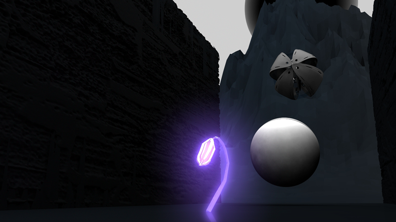
				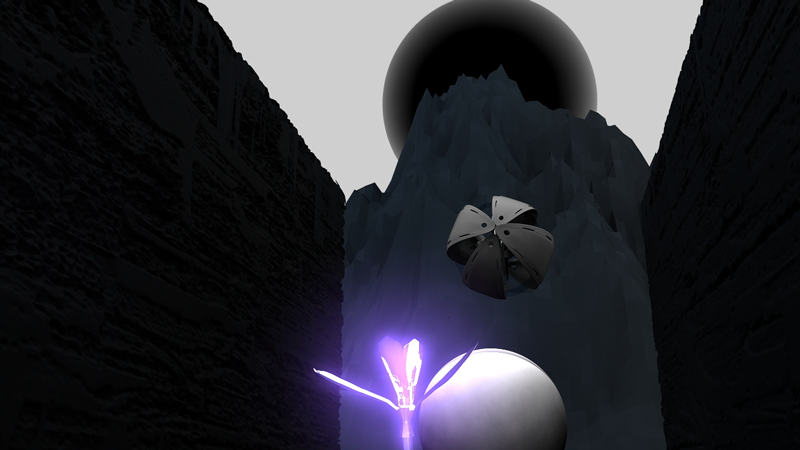
				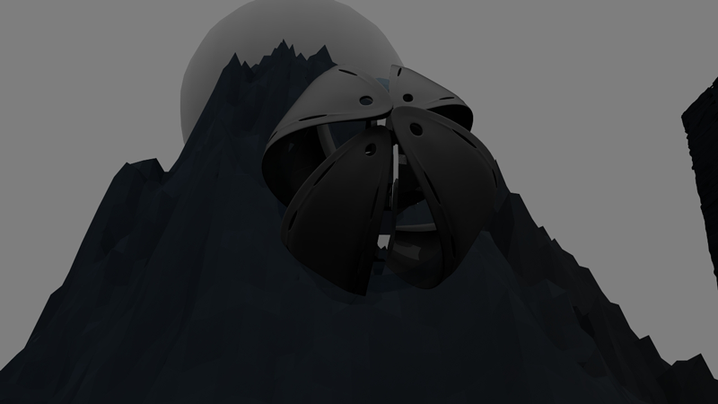
				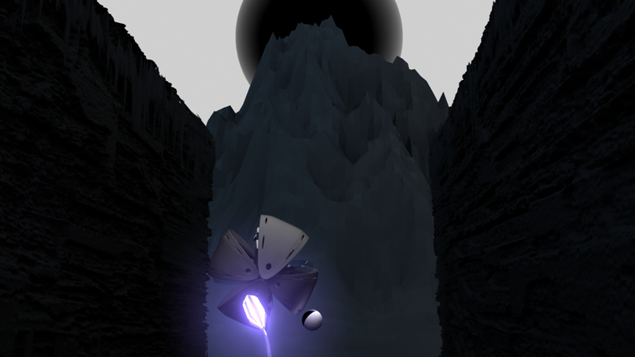
				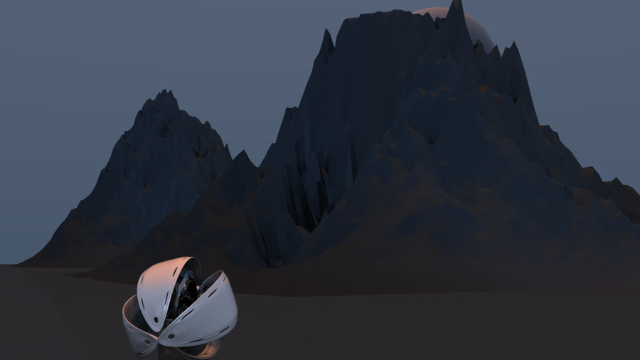
				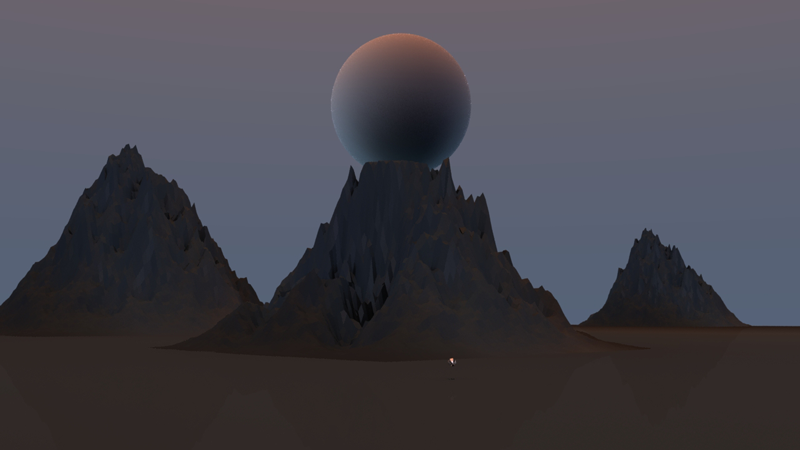
				
				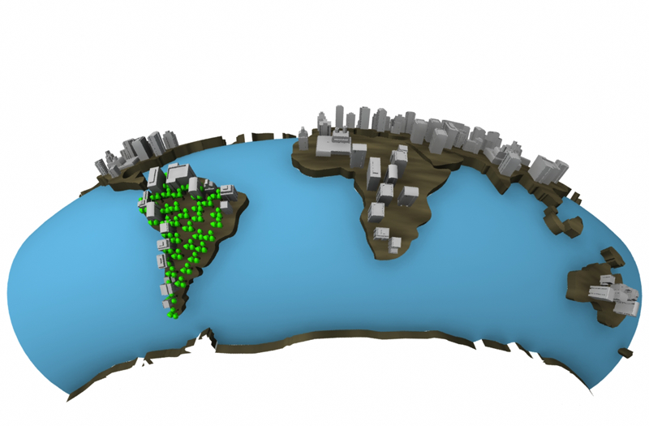
				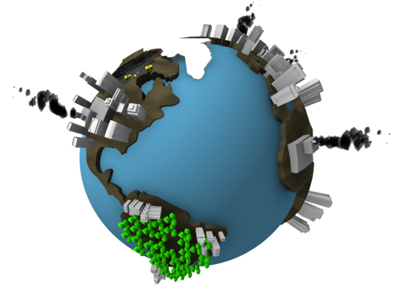
				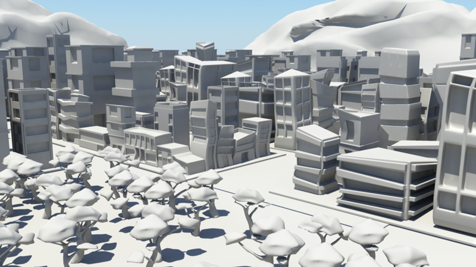
				
				
				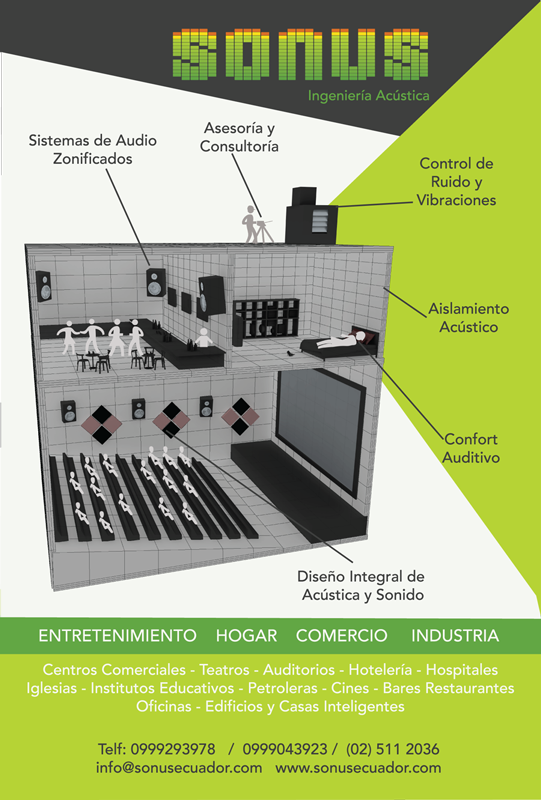
				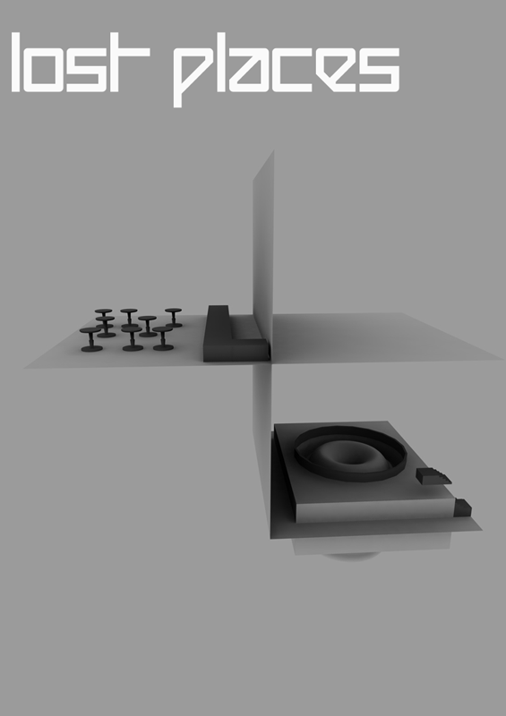
				
				
				
				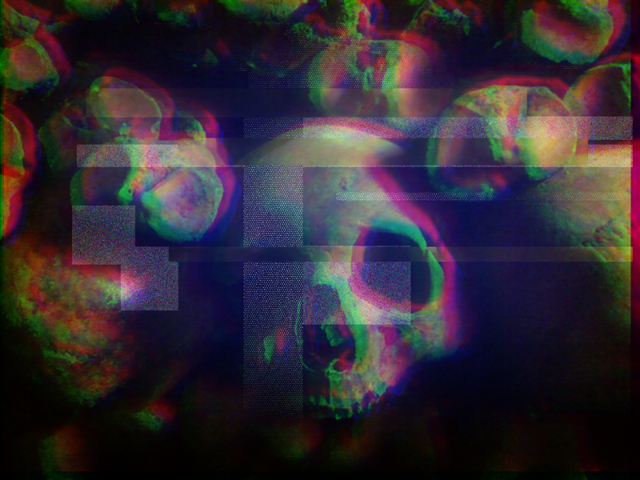
				
				
		

		

			

				
./Creative Coding - Programming with aesthetic intent.(i like that name better)

			

				
				
				
				
				
				
				
				
				
				
				
				

		

		

			

				
./Web - Front end developer

			

			<a href="http://www.techkum.com" target="_blank">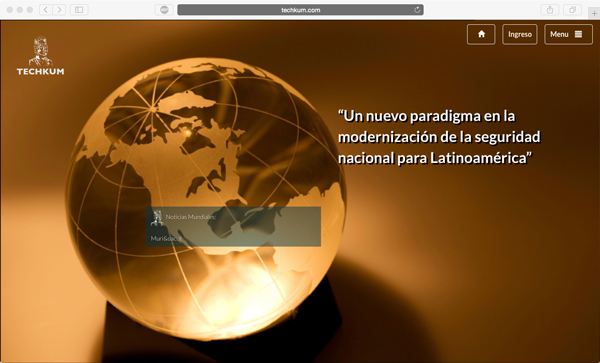</a>
			<a href="http://www.onesimpleidea.xyz/rutas" target="_blank">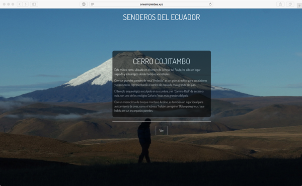</a>
			<a href="http://enmarcar.xyz" target="_blank">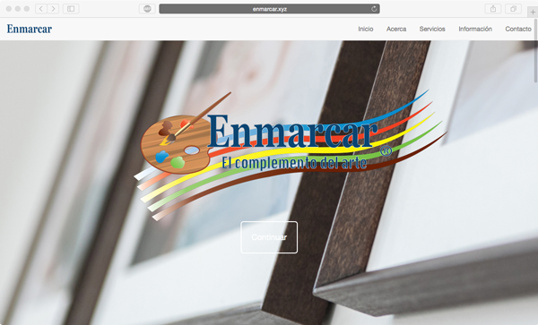</a>
			<a href="http://www.cedenma.org" target="_blank">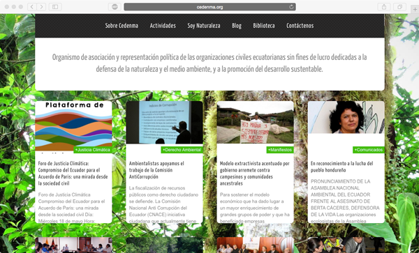</a>
		

	
<!-- end portafolio -->